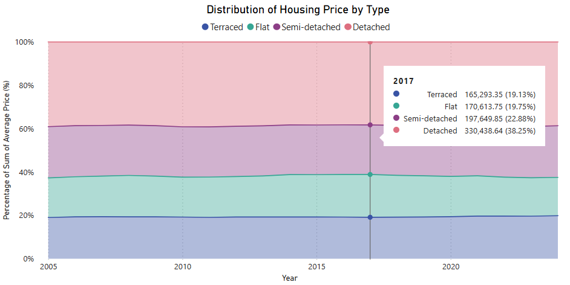

# UK Housing Analysis: Prices, Affordability, Sales, and Regional Breakdowns
---

# Background

This report explores trends in UK house prices over time, both in nominal terms and adjusted for inflation using the Consumer Prices Index (including owner occupiers’ housing costs) (CPIH). It also investigates housing affordability, measured as the ratio between average house prices and median salaries. In addition, the report analyses monthly sales volumes and offers a regional breakdown of housing activity across the UK.

# Objectives

The report looks to investigate the following five questions.

1. How have house prices changed each year in nominal terms, adjusted for CPIH (inflation), and in relation to the national median salary?

2. How has housing affordability changed over time in each region? Which regions are the most and least affordable in each year?

3. How have the prices of different house types evolved relative to one another over time?

4. What is the national trend in the total number of housing sales?

5. How are yearly sales distributed across the months, and do any seasonal trends exist?

# E.R.D. (Entity Relationship Diagram)

In this report, we use tables containing National and Regional House Price data, CPIH data, and National and Regional Median Salary Data. The source data for these was obtained from the following places:

- [UK House Price Index (HM Land Registry)](https://www.gov.uk/government/statistical-data-sets/uk-house-price-index-data-downloads-january-2025)
- [Annual Survey of Hours and Earnings (Sheet 12 - Full-time employees' pay by work region) (ONS)](https://www.ons.gov.uk/employmentandlabourmarket/peopleinwork/earningsandworkinghours/datasets/ashe1997to2015selectedestimates)
- [CPIH Index (ONS)](https://www.ons.gov.uk/economy/inflationandpriceindices/timeseries/l522/mm23)


Additionally, we make use of dimension tables for Dates and Regions. A diagram showing relationships between the tables is as follows:


# Summary of findings

Over the past 25 years, UK house prices have more than tripled in nominal terms, rising from about £75,000 in 1999 to £260,000 in 2024. After adjusting for inflation, this increase represents a near doubling in real terms. 

Affordability has worsened: in 1999, the average house cost around four times the median salary, rising to 7.5 times the median salary by 2021, where it has since stabilised. 

London has consistently been the least affordable region, with price-to-income ratios peaking at nearly 14 in 2016, whilst regions Scotland, Northern Ireland, and the North East have shared the title of most affordable region over various periods in the last 25 years. 

The relative prices of housing types (detached, semi-detached, terraced, and flats) have remained steady: flats and terraced houses cost roughly the same, semi-detached homes about 20% more, and detached houses around twice as much. 

Sales volumes reflect broader macroeconomic trends, with a sharp decline following the 2008 financial crisis, a slow recovery through the 2010s, a peak in 2021, and a notable drop since—likely driven by rising interest rates as a result of the post-COVID-19 inflation. Seasonality also plays a role, with quieter months in January and February, and more sales in summer months, particularly in July and August.

# Insights deep dive 
In nominal terms, average house prices in the UK have climbed significantly, rising from around £75,000 in 1999 to approximately £260,000 in early 2024. This represents more than a threefold increase nominally. However, when adjusting for CPIH (inflation), that is, expressing historic prices in "today’s money", the average house price in 1999 is about £135,000. Even after this adjustment, house prices have effectively doubled in real terms over the past 25 years. This long-term upward trend reflects the sustained demand for housing in the UK. When adjusted for inflation, average prices in 2007 are comparable to those in the present day. In the years between, house prices followed a broad “U”-shaped curve, instigated by the 2008 financial crisis, bottoming out in 2013 at a CPIH-adjusted £220,000, before steadily recovering through to 2022.


We define the affordability index as the ratio of average house price to median salary, with a lower index value indicating more affordable housing. In 1999, the national index sat at around 4, meaning the average house cost roughly four times the median income. By 2007, this had climbed to about 7, reflecting rapid price growth outpacing wage increases in the run-up to the financial crisis. Following the 2008 crash, the index dipped below 6 in 2009 and remained there until 2013. This period of improved affordability was largely driven by flatlining nominal house prices, likely due to the combination of reduced (buyer) demand and tighter lending conditions. From 2013 onwards, the index steadily rose, peaking at around 7.8 in 2022. Recently, the index has retraced slightly to around 7.45, possibly reflecting a response from the housing market regarding rising interest rates.


At a regional level, affordability varies significantly: London has consistently been the least affordable part of the UK, with its affordability index rising from around 6 in 1999 to 12.6 in 2023, peaking at approximately 13.8 in 2016. This reflects a combination of persistently high demand and the concentration of national wealth and opportunity in the capital. In contrast, regions such as Scotland and the North of England have regularly ranked among the most affordable, with ratios as low as 2.7 in 1999 and around 4.8 in 2023. Northern Ireland saw a dramatic surge in house prices in the years leading up to 2008, likely driven by free movement between itself and the Republic of Ireland, as well as the broader economic boom in the south, namely the "[Celtic Tiger](https://en.wikipedia.org/wiki/Celtic_Tiger)." The 2008 financial crisis hit the region particularly hard, to such an extent that it became the most affordable part of the UK (according to our affordability index) from 2012 to 2016. (Northern Ireland's affordability index can be seen on the graph below in Yellow.)


Regarding housing types, the relative prices of detached, semi-detached, terraced houses, and flats have remained fairly consistent over the past 20 years or so. On average, flats and terraced houses have been priced similarly, with semi-detached homes typically costing about 20% more. Detached houses, on the other hand, have consistently been priced roughly double that of flats and terraced houses.



Total national sales in the UK saw a steady rise from approximately 1.1 million in 2000 to 1.5 million in 2006. However, following the 2008 financial crisis, sales plummeted to as low as 750,000 by 2008, and remained stable at this level until 2012, reflecting the broader economic downturn. From 2014 to 2019, total sales gradually recovered, stabilising at around 1 million. A notable peak occurred in 2021, with sales reaching approximately 1.25 million. This was likely due to the government stimulus measures during the COVID-19 pandemic, which boosted market activity. Since then, however, total sales have sharply decreased, dropping to below 700,000 by 2024, likely due to rising interest rates and inflation.


House sales in the UK follow a subtle seasonal pattern. January and February tend to be the quietest months in general, with activity gradually building as the year progresses. The market typically sees increased activity during the summer, followed by a slight easing toward the end of the year.


# Power BI report

A report in Power BI (`HousingReport.pbix`) was created to summarise the insights found. A snapshot of the report is below:


The Year and Region slicers can be adjusted to display filtered data (note that the centerpiece is not affected by the Region slicer - this is intentional). 

House price trends (top left visual) can also be shown nominally or CPIH-adjusted.


# Technical Notes, Credits and Remarks

## Github Repository Structure

The GitHub repository has the following structure.
```
root/
├── InitialTransformedData/
│   ├── CPIHInitialTransform.csv
│   ├── HPIInitialTransform.csv
│   ├── HPINational.csv
│   ├── MedianPayInitialTransform.csv
│   └── MedianSalaryNational.csv
├── ReportWalkthrough/
│   ├── documentation_images/
│   │   └── ...
│   ├── ExportedSQLQueries/
│   │   └── ...
|   ├── Part1-PowerQuery-Initial-Transformation-Walkthrough.ipynb
|   ├── Part2-SQL-Modelling-Walkthrough.ipynb
|   ├── Part3-SQL-Quick-Insights-Walkthrough.ipynb
|   ├── Part4-PowerBI-Report-Walkthrough.ipynb
|   └── VisualsForInsights.pbix
├── WriteUpImages/
│   └── ...
├── HousingReport.pbix
└── README.md
```

Aside from the `README.md` file, a `HousingReport.pbix` file containing the report created in Power BI can be found in the root directory. This can be downloaded and interacted with.

Another notable part of the repository is the `ReportWalkthrough/` directory. It includes four notebooks that go through the full workflow step by step from start to finish: Initial Transformation, SQL Modelling, SQL Quick Insights, and the Power BI Report. It is here that all (read: most) of the behind-the-scenes work can be viewed.

## Reflections & Learnings

- I chose to use median salary data over mean salary data, as the latter is too heavily skewed by very high earners. Whilst not perfect, the median feels like a better representation of the "average person."
  
- Data is messy... Values are missing, and the formatting can be less than ideal to say the least. However, spending the time to clean it well makes the remainder of the workflow *so much* easier.
- Within (My)SQL, I have gained much more experience and confidence with CTEs. This includes recursive CTEs and the usage of CTEs within `CREATE TABLE ... AS SELECT` queries.
- This was the first project where I consciously applied and thought about modelling with a star schema structure (and, in particular, thinking of tables as either dimension tables or fact tables), and I have to say it makes things so neat and tidy! I am a big fan!
- Within Power BI, I have understood that DAX *is all about context*. I have also come to realise that DAX is ridiculously versatile, and a solution exists for almost any issue.
- I also deepened my understanding regarding the "philosophy of measures", how they behave, how they depend on context, and the amazing flexibility they have.
- Creating a step-by-step walk through of an entire workflow takes a *long* time :) but it will be nice to refer to and look back on in the future, and the process of writing everything up has helped me digest and understand concepts much better, so it was definitely worth it!

## Credits

The source data was obtained from the HM Land Registry ([Housing data](https://www.gov.uk/government/statistical-data-sets/uk-house-price-index-data-downloads-january-2025)), as well as the ONS ([Salary](https://www.ons.gov.uk/employmentandlabourmarket/peopleinwork/earningsandworkinghours/datasets/ashe1997to2015selectedestimates) and [CPIH](https://www.ons.gov.uk/economy/inflationandpriceindices/timeseries/l522/mm23) data).

When making the report in Power BI, I required a single select slicer with an additional option to "select all". This is not built-in functionality, but there are (as always) workarounds. I used one such workaround, found in [this YouTube video](https://www.youtube.com/watch?v=CTsNxnQvxns&t=141s).

I have learnt a lot about data analytics and how to create projects and get the most out of them (including how to structure README files) from [Christine Jiang's videos on YouTube](https://www.youtube.com/@christinejiangdata).
